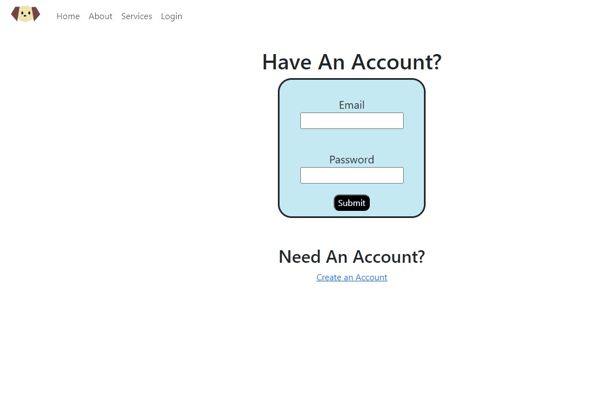

# Pristine_Paws

## Description

This web app was developed as part of a final project for the UNLV Software Development bootcamp.  The goal of the project is to utilize all the skills learned to created and deploy a full stack application.  I chose to create an app for a dog grooming service where users can learn about the business, create an account, and make and edit appointments online.  

## Installation

- Fork and clone the project: https://github.com/angiedeschutter/pristine_paws_heroku.git
- Server:
    - run npm install in the root folder
    - set env variables
    - run nodemon index.js for dev operation
    - run NODE_ENV=production PORT=8000 node index.js for production
- Client:
    - cd front_end
    - run npm install
    - run npm start
- To deploy on Heroku
    - git push heroku main
    - heroku open

## Usage

This is a mock website to demonstrate a website for users to learn about a dog grooming company with the ability to schedule appointments.  

- Create an account
```md
    
    ```
- Login to account
```md
    
    ```
- See Account information
```md
    
    ```
- Add appointment
```md
    
    ```
## Deployment

This project is currently deployed https://pristine-paws-bd61149d81a0.herokuapp.com/.

## Built With

- React
- Node.js
- Express
- Postgres
- Bootstrap
- Heroku

## Credits

- Images used are from Vecteezy:
    - https://www.vecteezy.com/photo/6973027-pomeranian-or-small-dog-breed-was-taken-shower-by-owner-and-stood-in-red-bucket-that-places-on-a-concrete-floor
    - https://www.vecteezy.com/photo/24398973-cute-little-puppy-in-bathroom-illustration-ai-generative
    - https://www.vecteezy.com/photo/2100438-woman-cutting-hair-a-dog


